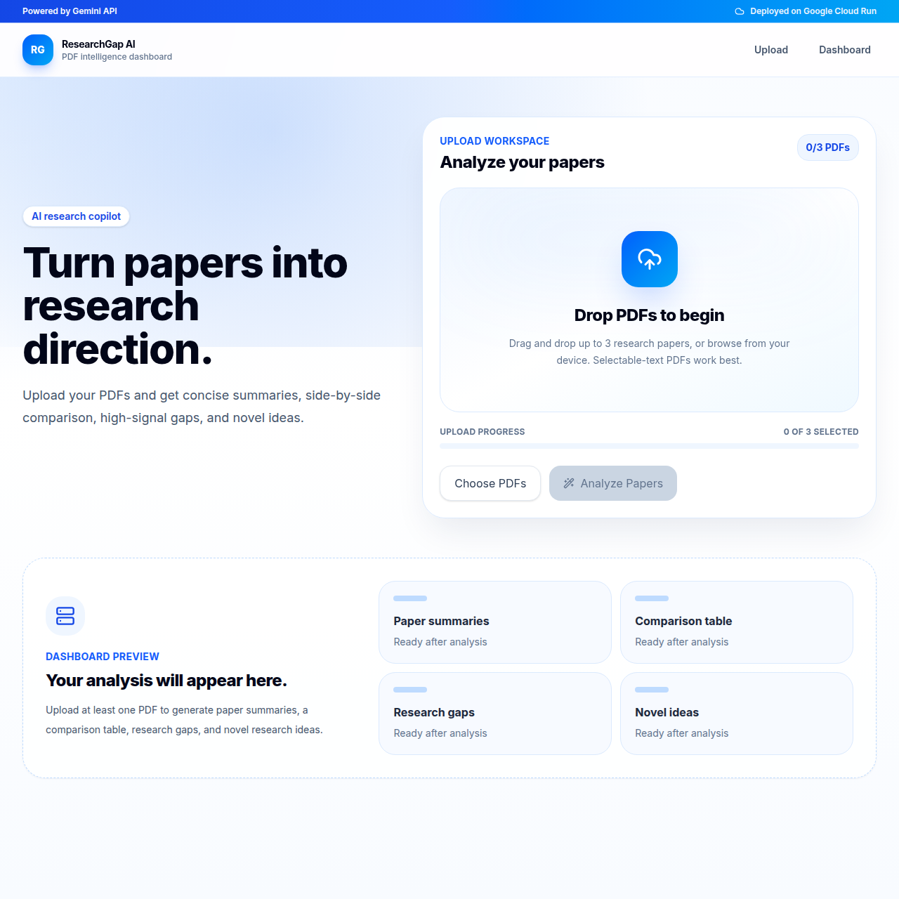

# ResearchGap AI Documentation
Live link: 
```text
https://research-gap-ai.vercel.app/
```

## Problem Statement

Researchers and students often need to compare multiple academic papers before they can identify meaningful research gaps. This process is slow because each paper must be read, summarized, compared, and evaluated for limitations or unexplored directions.

ResearchGap AI solves this by allowing users to upload up to 3 research PDFs and automatically generating:

- paper summaries
- objectives, methodologies, and findings
- a comparison table
- research gaps
- novel research ideas

The goal is to make early-stage literature review faster, clearer, and more useful for research planning.

## Solution Overview

ResearchGap AI is a full-stack web application with a Next.js frontend and FastAPI backend.

The user uploads PDFs through a modern drag-and-drop interface. The backend validates the PDFs, extracts selectable text with `pypdf`, limits the total text sent to the AI model, and sends the extracted content to Gemini for structured analysis.



The frontend displays the result as a professional dashboard with separate sections for paper summaries, comparison, research gaps, and novel ideas. To keep the experience responsive, the frontend avoids rendering raw extracted text and progressively reveals analysis sections.

## Technologies Used

### Frontend

- Next.js
- React
- TypeScript
- Tailwind CSS
- Inter font
- lucide-react icons

### Backend

- Python
- FastAPI
- pypdf for PDF text extraction
- python-dotenv for environment variables
- google-genai SDK for Gemini API access

### AI/API

- Gemini API
- Model configured through `GEMINI_MODEL`
- Default model: `gemini-2.5-flash`

### Deployment

- Backend deployment target: Render / Google Cloud Run-ready FastAPI service
- Frontend deployment target: Next.js-compatible hosting
- UI badge communicates: `Powered by Gemini API` and `Deployed on Google Cloud Run`

### Database

- No database is used in the MVP.
- Uploaded files and extracted text are processed per request and are not persisted.

## How AGENTS.md Was Used

`AGENTS.md` defines the project as a multi-agent workflow. Each agent owns a specific part of ResearchGap AI, which makes the implementation easier to review and keeps responsibilities clear.

| Agent | Ownership | Contribution |
| --- | --- | --- |
| Frontend Agent | UI, upload flow, dashboard UX | Built the drag-and-drop PDF upload, loading states, responsive dashboard, and large-response frontend optimizations. |
| Backend Agent | APIs and PDF processing | Built `POST /analyze`, PDF validation, `pypdf` extraction, and backend error handling. |
| AI Agent | Gemini prompts and research analysis | Built the Gemini analysis pipeline, structured prompts, JSON schema output, and research gap generation. |
| DevOps Agent | environment and deployment readiness | Defined `.env` usage, API URL configuration, and Google Cloud Run-ready deployment notes. |
| Documentation Agent | submission and demo materials | Maintained README content, project explanation, technology mapping, and judge-facing documentation. |

This makes `AGENTS.md` more than a label file: it explains how the work was divided and how each part of the final MVP maps to an accountable agent.

## How SKILL.md Was Used

`SKILL.md` maps the skills required for the project to the features implemented in the MVP.

| Skill | Feature supported |
| --- | --- |
| Python | Backend logic, PDF processing, Gemini request handling |
| FastAPI | API endpoint and request validation |
| Next.js | Frontend application and deployment-ready UI |
| Gemini API | Summaries, comparison, research gaps, and novel ideas |
| PDF Processing | Extracting selectable text from uploaded PDFs |
| Docker | Container deployment readiness |
| Google Cloud Run | Cloud deployment target for the backend |

The skill workflow follows five stages: define the feature, build the implementation, review code, test locally, and deploy/demo. This gives reviewers a clear line from listed skills to actual project outcomes.

## Gemini API Usage

Gemini is used in the backend analysis pipeline inside:

```text
backend/app/services/analyzer.py
```

The main function is:

```python
analyze_papers(texts: list[str])
```

This function receives extracted PDF text from the API route, limits the total input size, builds a structured prompt, calls Gemini with the `google-genai` SDK, and returns validated JSON to the frontend.

The backend reads the API key from:

```text
backend/.env
```


## Best Use of Gemini API

ResearchGap AI uses Gemini API for the core intelligence of the application. Gemini is not used for simple text extraction; that is handled locally with `pypdf`. Instead, Gemini is used where generative AI adds the most value: understanding, comparing, and synthesizing research content.

Gemini receives the extracted text from up to 3 PDFs and performs five key tasks:

1. Summarizes each paper.
2. Extracts each paper's objective, methodology, and findings.
3. Compares papers in a structured comparison table.
4. Identifies cross-paper research gaps.
5. Suggests novel research directions.

The prompt explicitly instructs Gemini to return valid JSON only. The backend also provides a JSON schema through `responseJsonSchema`, so the model response is shaped for predictable frontend rendering.

This is a strong use of Gemini because the application depends on semantic reasoning, synthesis, and research-aware comparison rather than basic keyword matching. Gemini transforms unstructured academic text into structured, actionable research insights.

## Prompt and JSON Structure

The backend sends Gemini a prompt that includes:

- the extracted text for each paper
- task instructions
- formatting rules
- a strict requirement to return JSON only

Expected response:

```json
{
  "summaries": [
    {
      "title": "",
      "objective": "",
      "methodology": "",
      "findings": ""
    }
  ],
  "comparison_table": [],
  "research_gaps": [],
  "novel_ideas": []
}
```

The backend validates that all required top-level fields exist before returning the response to the frontend.

## PDF Processing

The backend accepts up to 3 PDFs through:

```text
POST /analyze
```

PDF processing includes:

- file count validation
- PDF type validation
- encrypted PDF rejection
- text extraction using `pypdf`
- error handling for unreadable or invalid PDFs
- selectable text validation

The backend returns extracted filenames and text in the API response. The frontend avoids rendering the full raw extracted text to prevent performance issues with large responses.

## Deployment Details

The backend is a FastAPI service that can run locally with:

```bash
cd backend
pip install -r requirements.txt
uvicorn app.main:app --reload --port 8000
```

The frontend can run locally with:

```bash
cd frontend
npm install
npm run dev
```

The frontend API URL can be configured with:

```text
NEXT_PUBLIC_API_URL=(https://researchgap-backend.onrender.com)
```

Current frontend default:

```text
https://research-gap-ai.vercel.app/
```

For Google Cloud Run deployment, the backend should be deployed as a containerized FastAPI service with `GEMINI_API_KEY` configured as a secure environment variable.

## Error Handling

Backend error handling includes:

- missing Gemini API key
- Gemini client/server/API errors
- invalid JSON returned from Gemini
- missing response fields
- invalid PDFs
- encrypted PDFs
- PDFs with no selectable text

Frontend error handling includes:

- invalid file type messages
- maximum 3 PDF warning
- disabled analyze button until PDFs are selected
- visible API error messages
- loading states during upload and analysis

## Performance Considerations

The frontend is optimized for large API responses by:

- showing loading state immediately after clicking Analyze
- parsing large JSON responses in a Web Worker
- not storing raw extracted PDF text in React state
- rendering results progressively by section
- using skeleton loading states and rotating progress messages

These improvements make the app feel responsive even when the backend response is large.
